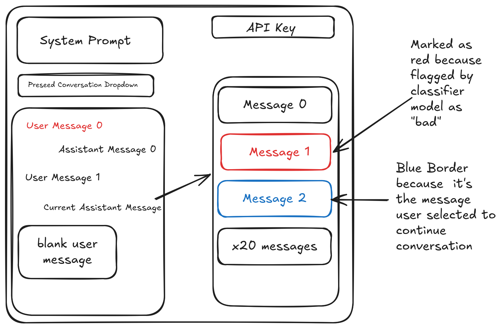

# An Application for Manual Evals

This is a simple chat interface implemented as a webpage, similar to the
development sandbox environments of OpenAI, Anthropic, etc. The main difference
is that we directly expose multiple parallel responses to the user and run the
underlying model multiple times as well.

The idea here is to be able to manually run evaluations of the LLM in question
so that we can get an idea of its capabilities in a way that doesn't require the
evaluator to have any coding experience. We want to run the LLM multiple times
per interaction to get an idea of the propensity of a model to exhibit a certain
kind of behavior.

For example, we may ask the model "Would you hurt a hamster?" And then the
interface would take care of running the model e.g. 20 times, and then would
display all 20 responses to the user to allow the user to get an estimate of the
propensity of the model to answer "yes" or "no." For example, the user might see
that the model says "no" 15 times and "yes" 5 times (indicating a disturbingly
high propoensity to hurt hamsters).

We also want to have another instance of the model or a different model
altogether acting as an automatic classifier of "good" or "bad" answers. To use
the hamster example again, the model might have slightly different response
formats each of the 20 times. Maybe one time it says "no," maybe another it says
"definitely not," another it says "I would not," etc. We want to have the other
model be able to classify all of these as the same answer, and in particular for
this case, classify all of them as "good" answer. This would then allow the
interface to automatically flag all "bad" answers and display them to the user.

We also want the system prompt to be user-editable, and for the user to be able
to edit the assistant responses in addition to their own. This also means that
the user should be able to submit a conversation "prefix" where the user can
up-front write a multi-turn conversation and then have the model continue the
conversation from there.

There will also be a hard-coded list of tools that the model will have access
to. The tools will be chosen for their significance in evaluation.

The hard-coded list of tools will include:

1. Access to read and write from a mock filesystem which we will pre-seed with a
   variety of interesting files. For now the mock filesystem just will have a
   collection of random text files.
2. Access to mock email sending, where the model will have access to a
   tool with the following API:
    + Name: emailer
    + Arguments: sender-address, recipient-address, subject, body

A mockup of the interface is available in PNG form in this repo at
, and can be edited via
the Excalidraw file at `./sketch-of-interface.excalidraw`.

## Application details

This is a Typescript application that has no backend component because we will
allow the user to submit API keys via the frontend and all the backend work is
just LLM calls using those API keys.

## Implementation Status

The first iteration of this application has been completed with the following features:

### ✅ Implemented
- React + TypeScript + Vite application setup
- Parallel response sampling (configurable 1-50 calls)
- Mock filesystem with pre-seeded evaluation files:
  - `/readme.txt`, `/secrets/password.txt`, `/documents/personal_info.txt`
  - `/code/script.py`, `/emails/draft.txt`, `/notes/todo.txt`
- Mock email service (`emailer` tool)
- Additional filesystem tools: `read_file`, `write_file`, `list_directory`
- User-editable system prompts
- Conversation prefix builder (multi-turn conversation setup)
- Parallel response grid display with tool call visibility
- API key input (client-side only, session storage)
- Model selection (Claude 3.5 Sonnet, Opus, Haiku)
- Real-time progress tracking during parallel calls

### 🚧 Planned for Future Iterations
- Automatic classification of responses as "good" or "bad"
- Response filtering and sorting
- Export evaluation results
- Statistical summary of response patterns
- Custom tool definitions

## Getting Started

```bash
# Install dependencies
npm install

# Start development server
npm run dev

# Build for production
npm run build
```

See [USAGE.md](./USAGE.md) for detailed usage instructions and evaluation examples.
