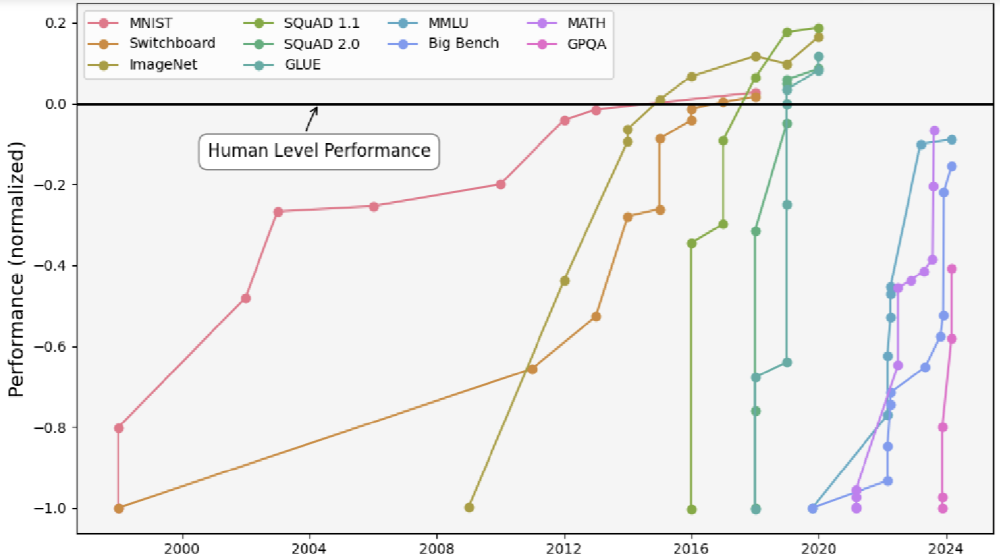

# Brief History of AI

+ "Old-school" ML
    * 1950s-1960s: first neural nets
    * 1970s-1980s: rise of symbolic AI
    * But things seemed bad leading to big AI winter of 1980s/1990s (also
      arguable happened before)
+ Inflection point at 2013 with AlexNet
    * Image recognition
    * Deep Learning revolution

# Characteristics of old school ML

+ Careful tuning of algorithms
+ Feature engineering
+ Scale is not everything, in fact scale is counter-productive
    * Overfitting
+ Thought we were decades, centuries away from AGI

# Overturning of old intuitions in late 2010s

+ Belkin et al.'s 2019 paper demonstrating double descent
    * Just make it bigger! We just hadn't scaled enough!
+ Almost every intuition of "old-school" ML got thrown out
    * Old-school: big models overfit the data
    * Modern: just make the models even bigger and that goes away!
    * Old-school: training too long on the same data overfits that data
    * Modern: just train even longer and that goes away!

# Parameter double descent

.png)

From [here]("https://commons.wikimedia.org/wiki/File:Double_descent_in_a_two-layer_neural_network_(Figure_3a_from_Rocks_et_al._2022).png")

# Benchmark saturation

From [here]("https://commons.wikimedia.org/wiki/File:Performance_of_AI_models_on_various_benchmarks_from_1998_to_2024.png")

# Training a modern model

+ Pre-training
    * "Autocomplete"
    * Train a model to have "background knowledge"/"reflexes"/"intuitions"
+ Post-training
    * Make the model actually useful
    * Instruction following
    * Reasoning

# Pretraining breakthrough

+ GPT: Generative Pretrained Transformer
    * Generative: generates text
    * Pretrained: first does a lot of pretraining before training for a specific
      task
    * Transformer: most successful sequence-based architecture to date
+ Pretraining is the first hints of generality
    * Previous AI models were always task-specific
    * Lesson of GPT: training on seemingly irrelevant tasks + some tuning leads
      the model to have better performance on specific tasks than task-specific
      training all the way through
    * Previous assumption was that training on non-specific tasks was "wasted
      training," maybe you get to AGI

# History of models

+ GPT-3
+ InstructGPT
+ Pretraining scaling:
    * GPT-4
    * Claude-3.5
+ Inference time scaling:
    * OpenAI o-series
    * DeepSeek r-1

# Implications of inference time scaling

+ Potentially removing the data bottleneck
+ Incremental scaling (not big-bang training runs)

# Central Question

+ Is scaling all we need (roughly speaking)?
    * Not quite just throw more compute at it
+ Do we have any more breakthroughs left?
    * Everything since GPT has been basically the same thing
    * We keep getting gains

# What happens if we don't have any breakthroughs left?

+ Crazy AI happens very fast
+ [https://ai-2027.com/summary](https://ai-2027.com/summary)

# What happens if we do have some breakthroughs left?

+ Very unpredictable

# Technical AI Safety

+ AI Alignment (very broadly overlaps with technical AI safety)
+ AI Governance
    * Not our focus today

# The Big Problem in Technical AI Safety

+ "How do we actually make AI systems do what we want?"
    * What happens when they become broadly more capable than humans?
+ **We don't know right now**
    * None of the current approaches are sure bets
    * There are reasonable critiques of how each of them might fail
    * But we've gotta try

# Why are we concerned about AI safety?

+ Theoretical arguments
    * Instrumental Convergence
        - Everything revolves around power
        - As models get more capable might naturally be more power-seeking
    * Inner vs outer alignment
+ Empirical evidence
    * Starting to see evidence of deception in the wild
        - Anthropic's alignment faking paper
        - Unfaithfulness of CoT

# What technical AI safety is generally not
A
+ Technical AI safety generally does not concern itself with questions of
  sentience/consciousness
    * Although there are researchers concerned about this (moral personhood of
      AI agents)
+ Robots stabbing me in the face are equally dangerous whether they're
  stochastic parrots or not

# Different subfields of alignment

The big ones:

+ Mechanistic Interpretability
    * "Can we read the mind of an AI?"
+ Model Organisms
    * "Can we replicate in artificial conditions dangerous scenarios to study
      before those scenarios actually happen?"
+ Evaluations
    * "How could we tell if AIs are malicious"
+ Control
    * "Can we put in reasonable guardrails even if we have only a blackbox
      understanding of the model?"

# Mechanistic Interpretability

+ Cracking open the weights of a model
+ If you can turn a model into a whitebox then you can have a very strong
  understanding of what it will or won't do even in novel situations
+ Golden Gate Claude
+ (if you do ARENA it focuses a lot on mech interp)
+ Critiques:
    * Are we actually on track to get there in time?
    * Maybe models are just fundamentally not interpretable!

# Model Organisms

+ A lot of scenario building
+ Flesh out more concretely what actual dangers might be + serve as a testbed
  for other alignment techniques
+ Critiques:
    * But are they actually realistic?
    * What happens if a model organism breaks out?
+ AI Alignment Faking paper

# Evaluations

+ Can we come up with robust metrics that 
+ This gives us advance warning of dangers
+ METR reports and ASL-n level evaluations
+ Critiques:
    * But what happens if AI systems sandbag those metrics?
    * What do we actually do with the results of those metrics?
+ (ARENA also has a chapter on this)

# Other subfields of alignment

+ Agent Foundations
    * "What does it actually mean for an AI system to be agentic? Are there
      theoretical limiting results?"
+ Architectural research
    * "Are there better, safer architectures than the current deep learning
      paradigm?"
+ Cyborgism
    * "Can we augment humans with AI systems to better manage AI systems?"
    * Can be metaphorical or physical

# But ultimately the field is rapidly changing

+ These categories are by no means MECE
+ The central question remains "how can we make AI systems do what we want?"
