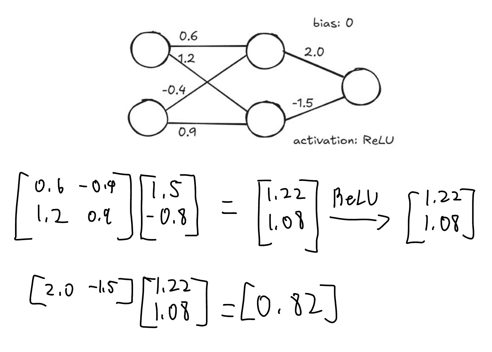

*Exercise*:

> Calculate what the output of this single neuron is if it was given the two
> inputs 2.0 and 1.5 (corresponding respectively to the top input and the bottom
> input).
>
> 

Solution

$\text{ReLU}(2.0 \cdot 0.5 + 1.5 \cdot -0.1) = 0.85$

*Exercise*:

> Calculate what the output of this single neuron is if it was given the two
> inputs 0.1 and 5 (corresponding respectively to the top input and the bottom
> input).
>
> 

Solution

$\text{ReLU}(0.1 \cdot 0.5 + 5 \cdot -0.1) = 0$

*Exercise*: 

> Given the following diagram, calculate what the output of the neural net
> should be "layer by layer" in the traditional way.
> 

Solution

*Exercise*: 

> Given the following diagram, calculate what the output of the neural net
> should be in our "key-value" decomposition of a vanilla neural net.
> 

Solution

