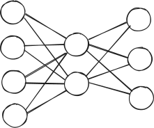

# Mechanistic Interpretability (Vanilla Neural Nets)

+ Assume you know what a neural net is
+ What is mechanistic interpretability?
    - Interpretability: trying to find a way to understand something
    - Mechanistic: finding the specific, concrete mechanisms used
        * Ideally you could drill down to the per-neuron level
+ We want to delve into the black box

# Common themes of mechanistic interpretability

+ Finding mathematically equivalent or near-equivalent restructurings of an
  architecture
+ Proving causality
+ Here, we are analyzing exactly how our model processes images!

# Our object of study

+ Vanilla neural net (single hidden layer)
+ Much simpler than modern LLMs
+ But still complex enough to demonstrate the fundamental themes of mechanistic interpretability

# What you'll be able to do at the end of the day

+ Get a new look at the traditional vanilla neural net architecture
+ Thoroughly and mechanistically explain why the NN gets certain digits wrong (and right)

# Standard way of thinking about a single hidden layer NN

+ There are two (three if you count inputs as neurons) layers of neurons
+ We pass iteratively from one layer to the next
+ Therefore to understand why 

# Diagram of standard neural net

# Standard layer by layer decomposition

# Alternative decomposition: key-value

# Calculate as "key-value" decomposition

# Concrete Example

# Concrete Example

# Concrete Example

# Concrete Example

# Concrete Example

# Exercise

# Calculation With Traditional Layer-by-Layer Interpretation

# Calculation With Key Value Decomposition

