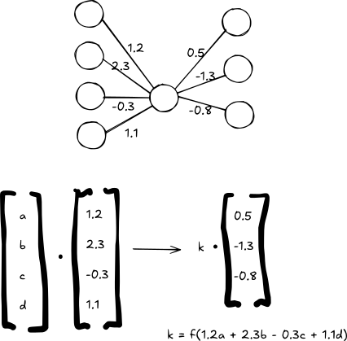

# Mechanistic Interpretability on Vanilla Neural Nets Workshop

Understanding How a Vanilla Neural Net Does Image Detection from the Inside Out

# Overall Structure Today

+ We'll assume:
    - You have some basic Python knowledge
    - You've built and trained a basic neural net in the past
+ We'll be doing:
    - Quick overview of mech interp and how we're using it today
    - Some conceptual exercises
    - Some coding where we play around with real neural net models and try to
      understand how they do image recognition

# The AI Safety Challenge

+ We are building increasingly powerful AI systems
+ Current trajectory points toward AGI (Artificial General Intelligence) and potentially ASI (Artificial Superintelligence)
+ **Critical problem**: We don't understand how to actually make these
  increasingly capable systems reliably do what we want
+ We deploy systems we cannot:
    - Fully predict
    - Reliably control
    - Comprehensively debug

# Technical AI Safety Problems

# Note 

+ There are a host of other social AI safety problems
    - Who gets to decide what an AI should do?
    - How should society
+ Today we're focused on the technical problem

# We Might Not Have a Lot of Time

+ AI companies think there's a chance we might get AGI very soon

# Uncertainty Remains

+ 

# Mechanistic Interpretability: One Bet

+ **Goal**: Reverse-engineer neural networks to understand their internal mechanisms
+ **Promise**: If we can understand how models work, we might:
    - Detect deception
    - Identify dangerous capabilities
    - Verify alignment with designer objectives
+ **Reality**: Current progress is promising but severely limited

# Why Study Mechanistic Interpretability Anyway?

1. **Building foundations**: Today's toy models teach us techniques for tomorrow's challenges
2. **Developing intuitions**: Understanding simple systems helps us reason about complex ones
3. **Creating tools**: Methods developed now may scale with future innovations
4. **Inspiring solutions**: Deep understanding often precedes breakthrough insights
5. **It's plain beautiful**: Mechanistic interpretability can be fun!

# Current State of the Field

## What we can do:
+ Identify some circuits in small models
+ Understand basic features in vision models
+ Find some interpretable directions in language models

## What we **cannot** do:
+ Fully interpret even small models
+ Reliably detect deception
+ Predict emergent capabilities
+ Scale our techniques to frontier models

# Disclaimer

+ **No current AI safety approach is confidently on track to solve AGI/ASI alignment**
    - There are reasons to doubt the viability of any single approach
    - This including mechanistic interpretability!
+ The gap between our understanding and our capabilities is **growing**, not shrinking
+ This is one of the most urgent technical challenges in the world at the moment
    - Which is why we need more brilliant people working on this!
+ **We have many bets, but we don't know if one or any will pan out.**
    - This is a bad situation!
    - But not hopeless: this is where AI capabilities was before LLMs rolled around
    - We have hope that one bet will work, but unsure which one

# Today's Object of Study

+ We'll study a **vanilla neural network** - vastly simpler than modern systems
+ Even this simple model exhibits surprising complexity
+ You'll learn fundamental mechanistic interpretability techniques
+ The general contour of the work applies to larger models nad more complex
  architectures

# Common themes of mechanistic interpretability

+ Finding mathematically equivalent or near-equivalent restructurings of an
  architecture
+ Being able to identify specific, concrete parts of a model that are
  responsible for 

# What you'll be able to do at the end of the day

+ Get a new look at the traditional vanilla neural net architecture
+ Thoroughly and mechanistically explain why the NN gets certain digits wrong (and right)

# Standard way of thinking about a single hidden layer NN

+ There are two (three if you count inputs as neurons) layers of neurons
+ We pass iteratively from one layer to the next
+ Therefore to understand why 

# Diagram of standard neural net

# Standard layer by layer decomposition

# Alternative decomposition: key-value

# Calculate as "key-value" decomposition

